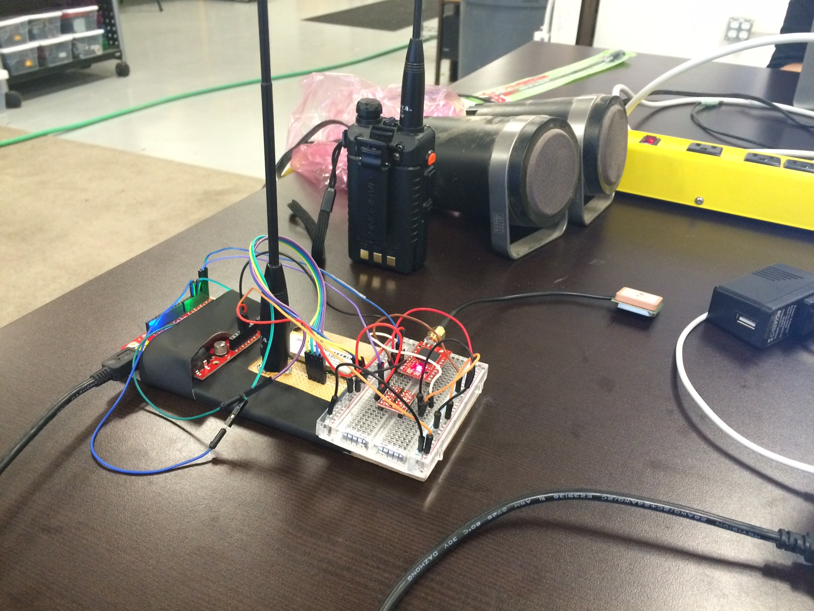
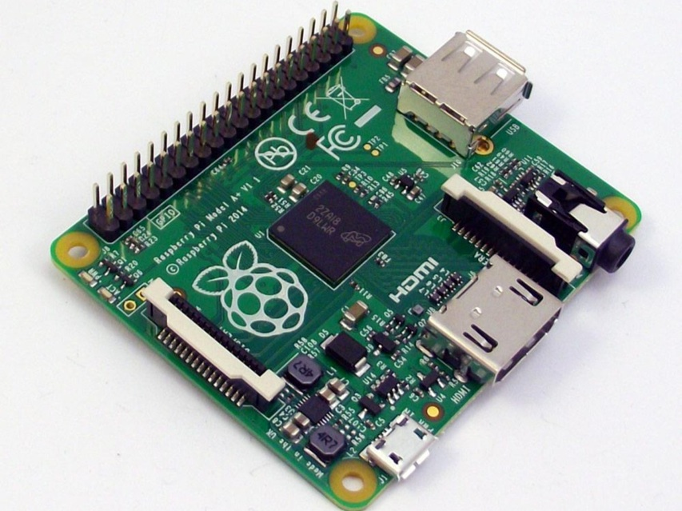

# [fit] JS in (Near) Space
### by @makenai


---


^ Space. It seems to go on and on forever.

---


^ But then you get to the end and the gorilla starts throwing barrels at you.

---


^ I originally pitched this talk with the hopes that a balloon had been launched, there had been a lot of data, cool videos, and photos to share. That hasn't happened.

^ Being all too familiar with Murphy's law, I also added a disclaimer that everything could go horribly wrong and this would turn into a post mortem. This isn't a post mortem either.

^ The project is still in progress, so instead I thought I would share what we've done so far, all of the important things we've learned, and what we're planning. It ends up being a lot of information on the mechanics and regulations of high altitude balloons and a little on interfacing to useful sensors with JavaScript for data logging.

^ Has anyone here worked with high altitude balloons before?

^ Has anyone heard of them?

---

# What is 'near space'?


^ Near Space is a region of the atmosphere that start at about 65k feet
^ You can start to see the curvature of the earth
^ This is Armstrong's limit, where the atmospheric pressure is so low, water boils at body temperatire
^ This photo is taken from around 100,000 feet
^ 50km = 164ft
^ ISS is 400km


---


^ The term 'near space' includes the Stratosphere, Mesosphere and Thermosphere
^ Commercial jets fly at 30,000 to 45,000 ft (9km-14km meters)
^ Our balloon will go to around 90k feet (28k meters), so just a little into the stratosphere, but that's plenty high enough to be awesome!

---

# ZASA Project


^ This project started as an internal hackathon with coworkers at Zappos, where I was working at the time. It was a 3 day hackathon, and so the scope was really limited. A lot of the time was spent researching high altitude balloons, and the final payload ended up being a Zappos box with a camera and commercial GPS unit. It burst a few feet off the ground during the initial launch, but the adventure was cool enough to convince everyone to keep trying!

---

# [fit] Physical Requirements

---

# High Altitude Balloon


^ First, you're going to need a balloon. Weather balloons are the most common.
^ We're using a Kaymont 600. Weather balloons are sold not by diameter, but by weight in grams.
^ The weight of the balloon will determine how heavy of a payload it can carry and at what pressure it might burst.
^ As the balloon goes high, the pressure around it decreases and the balloon expands
^ You'll need to calculate the time to burst, so you can guestimate where it might end up - uckily there are calculators for this.
^ The balloons are made of very thin latex and must be handled very carefully since the oil in your skin can damage them.

---


^ You then need to fill the balloon with stuff lighter than air. Most of the time this will be either hydrogen or helium.
^ Even being cognizant of the helium shortage, we chose to use helium since we don't totally know what we're doing and would like to avoid becoming fireballs.
^ You can get tanks of helium and purchase a regulator from a commercial gas supplier in your town. We had to put a hefty deposit down on the tanks thought.

---

# [fit] Legal Requirements

---


# Code of Federal Regulations

Title 14
Chapter I
Subchapter F
Part 101
Subpart D

^ There are a number of laws and regulations you need to be aware of when launching a balloon:
^ You have to notify your nearest FAA Air Traffic Control
^ Can't launch in a city
^ Can't launch on a cloudy day
^ Need two ways to terminate the flight of the balloon, one can be the balloon popping at high atmosphere
^ For the other, we have a cord cutter set on a timer, which is basically a tiny gun
^ Need to be labelled
^ Needs to be radar reflective

---


# [fit] Recovery
# [fit] Requirements

^ OK, so you've sent something up very high into the stratosphere. Now what?
^ Probably, you're going to want to get whatever you sent up back in one piece, so you're going to need a recovery system.

---

# [fit] Parachute


^ A parachute is pretty much a parachute. You can see it connected between the balloon and the payload, so that when the balloon bursts, the parachute is there to slow the descent so it doesn't land too hard.

---

# Tracking System


^ You'll want to know where the balloon is so that you can go recover it!
^ The ZASA version used a spot GPS unit that broadcast your location via a sat phone and had a hefty subscription cost.
^ However, there is already a free system for broadcasting location updates via short wave radio called APRS.
^ In order to broadcast on the APRS frequency of 144.39, you need a HAM radio technician license
^ You even need a valid callsign to buy the transmitter (that little boxy bit)
^ 4 of us ended up getting licensed - kind of a redundant backup in case we didn't do so well, as well as giving us spares if we had a license revoked for not knowing what we were doing
^ One mistake was thinking we'd know anything useful about HAM radio after passing the licensing exam.. nope.
^ This tracker design features a GPS unit from sparkfun and a radio transmitter from Lemox and is based on an open source design called Trackuino.

---



^ The first version looked like this, so you can see that a little skill with soldering will take you a long way..

---


^ This is a screenshot from aprs.fi, a popular APRS tracking site. Each little dot there has a ham radio call sign associated with it, and could be a station, car, balloon or a number of different things.
^ We had an incredible hard time getting our dot to show up on this map
^ The radio signal needs to reach a digital repeater station in order to register
^ It isn't a problem for a balloon from 1000 feet in the air to do this, but for us on the ground it was harder

---


^ It took a of weekends of debugging and sneaking on to the roofs of tall building with very some very dodgy looking equipment.

---


^ None of that worked and we ended up having to build a digipeter station using a laptop and a $20 software defined radio that 'repeated' the APRS tracking signal over the internet where it would show up on aprsi.fi
^ Success!

---


^ It's not enough to see where your balloon is headed in real time. You're going to want an idea of where it will end up, or else you might be stuck watching helplessly as it lands 100 miles out in the ocean or in the middle of a highly restricted government facility you can't drive on to.
^ A website called habhub.org has a lot of useful calculators for things like that. Including this one where you put put your variables in, and it will calculate where it is likely to burst, and where it is likely to drift off to using current weather data.
^ After that, it's just a matter of launching the balloon, chasing it in your car, and then hiking off into the wilderness to retrieve it, avoiding mountain lions and bears.

---

# [fit] Purpose

---

# Payload

^ The payload is the small box at the very bottom of the balloon that contains all of your stuff. Ours is made out of reflective styrofoam insulation material that will be keep the insides insulated from the extreme cold.

---

# Sensor Inventory

- Downward camera
- 360 degree camera
- Electronic compass
- GPS (on tracker)

---

# Sensors (cont)

- Barometric pressure
- 3 axis gyroscope
- 3 axis accelerometer
- Thermistor (temperature)

---


^ The downward facing camera is nothing special. It's just an Microsoft Lifecam. However, the 360 degree camera is a little more interesting.  It's a raspberry pi camera, very similar the camera on your cell phone.
^ There is a dome attached to it using a custom 3D printed adapter that lets it capture video in all directions by distorting it with mirrors.
^ The dome is a cell phone addon call the DOT that seems to have been discontinued recently as I picked up a couple at clearance prices
^ There was some extra plastic that needed to be cut away.

---


^ This is what video captured on the device looks like. It's not very pleasant, but you can unwrap the video by projecting it on to a cone with the same basic shape as the lens.

^ I'm planning on doing this by playing the video as a WebGL texture of a cone and placing a rotatable camera inside the shape. I don't have a demo, but preliminary tests are promising!

---


^ This is what most of the sensors look like. These are from SparkFun, but you can also get them from Adafruit, Pololu and similar other places.

^ You normally connect power and ground from your controller to each sensor module, and 1 or more signal pins. A 9 axis motion sensor is likely to have at least 9 + 2 pins you need to connect.

^ Each signal pin reports data by variable voltage

---



^ The sensors, cameras and tracker all connect into a Raspberry Pi, that becomes the brains of the payload, recording video, polling sensors and saving the data into a timestamped json stream, becoming a data logger.

^ It also runs a timer for the cord cutter

^ There are a series of pins running across the top of the Pi called GPIO pins. General Purpose Input and Output. This is where you can connect the sensors. There's a special ribbon connector for the Pi camera, and the other camera just connects via USB.

---

# Johnny-Five


^ Pi is basically a small computer, and will run nodejs with no problems at all.
^ You can talk to the pins directly and interpret the voltages on your own, or you can make your life a lot easier and use Johnny-Five which will poll the sensors for you and has a lot of smart convenience methods.

---

```javascript
var five = require("johnny-five");

five.Board().on("ready", function() {

  var temperature = new five.Temperature({
    controller: "LM35",
    pin: "A0"
  });

  temperature.on("data", function(err, data) {
    console.log("temperature");
    console.log("  celsius      : ", this.celsius);
    console.log("  fahrenheit   : ", this.fahrenheit);
    console.log("  kelvin       : ", this.kelvin);
    console.log("--------------------------------------");
  });

});
```

^ As you can see, you simply define your sensor, tell J5 where it is connected, and you get a nice data callback that interpret the signals for you as a nice high level value.

---


---

# Resources

- FCR - http://www.ecfr.gov/
- Trackuino - http://www.trackuino.org/
- APRS.fi - http://aprs.fi/
- HabHub - http://habhub.org/
- Johnny-Five - https://github.com/rwaldron/johnny-five

---

# Thanks!

Slides : http://makenai.github.io/SpaceJS
